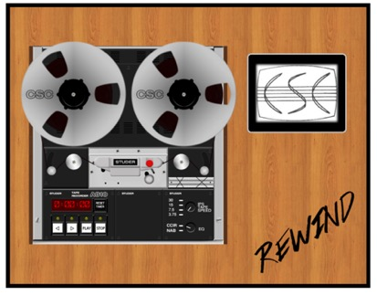

# REWIND - Tape recorder

<p align="center">
  
</p>

## Description

This repository contains the source code of a web application that virtualizes an reel-to-reel tape recorder using the Web Audio API.
The project also uses web technologies such as: PHP, HTML5, CSS3 and jQuery.
This project provides the following features:

*  **Audio playback**:  you can play a track simply with the tape recorder interface, you just need to load the tape from the track loader and play it by clicking on the play button;
*  **Reproduction Control**: you can manipulate the reproduction of the tracks with pause, fast forward (ff) and rewind buttons;
*  **Reset timer**: you can set the timer at zero when you want, by clicking on the reset timer button;
*  **Speed control**: you can set the reproduction speed of the tape;
*  **Equalization control**: you could set the equalization profile for the reproduction;
* **Track Loader**: using the track loader you can manage the tracks of your collection: you can choose the next track to play and the tracks to delete, you can also replace the audio/video file associated to a track with a new audio/video file specified through the upload interface.
* **Upload/Download Area**: the tape recorder is also equipped with an "Upload/Download Area" in which you can:
    * Import a single track;
    * Download the tracklist in JSON format;
    * Download all the tracks in a single zip file;

* **Waveform visualization**: during the playback of a track, it is also possible to visualize the waveform of the audio; the waveform equips a header which tells you the position of the current playback;

## Installation
All the project files are in the "taperecorder" folder.

It is recommended to use a docker, you can find the `DockFile` under the `docker` folder.

To build a docker image, go inside the docker folder.

`$cd docker`

Build the image by typing

`$docker build -t [TAG] .`

You need to specify a tag name which identifies the image.

If you want to change the php configuration, you need to edit the `php.ini` inside the docker folder and rebuild the image.

## Usage

Go to the root folder of the project i.e. ~/PATH_TO/rewind_taperecorder/

then run the docker

`$ docker run --rm -it -p [PORT]:80 -v $PWD:/var/www/html [TAG]`

Then, open the browser at this address:
```
http://localhost:PORT/taperecorder/taperecorder.php
```
Where:
* [PORT]: is the port used of the web server you specified.
* [TAG]: is the image tag name you specified before.


## Credits
This is the second version of the software developed by [*Niccolò Pretto*](http://www.dei.unipd.it/~prettoni/) under the supervision of Sergio Canazza [1]. 

In this new version, several features are implemented. The developers who partecipate to this update (under the supervision of [*Niccolò Pretto*](http://www.dei.unipd.it/~prettoni/)) are: 
* _Riccardo Galiazzo_
* _Fabio Giachelle_
* _Luca Piazzon_
* _Daohong Li_

The repository includes snippets of code and algorithms from the following repositories:
* **getID3**: https://github.com/JamesHeinrich/getID3
* **peaks.js**: https://github.com/bbc/peaks.js

## References

[1] C. Fantozzi, F. Bressan, N. Pretto, and S. Canazza. "Tape music archives: from preservation to access". *International Journal on Digital Libraries*, 18(3):233–249, September 2017. ISSN 1432-1300. doi: 10.1007/s00799-017-0208-8.
